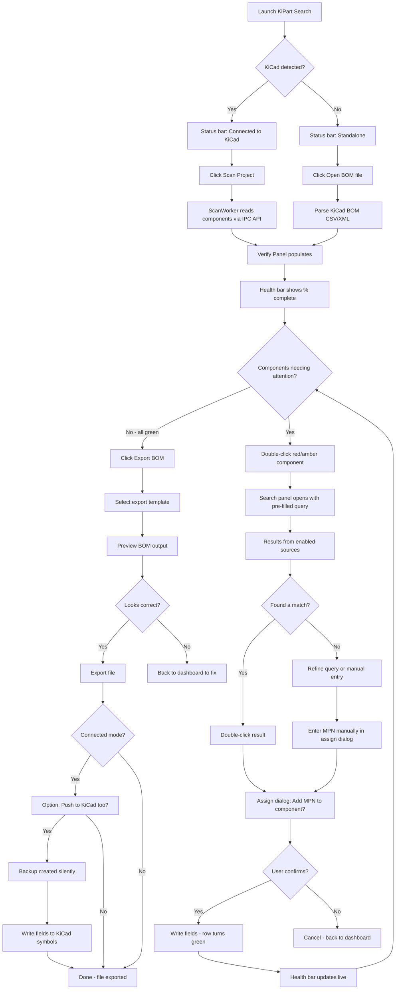
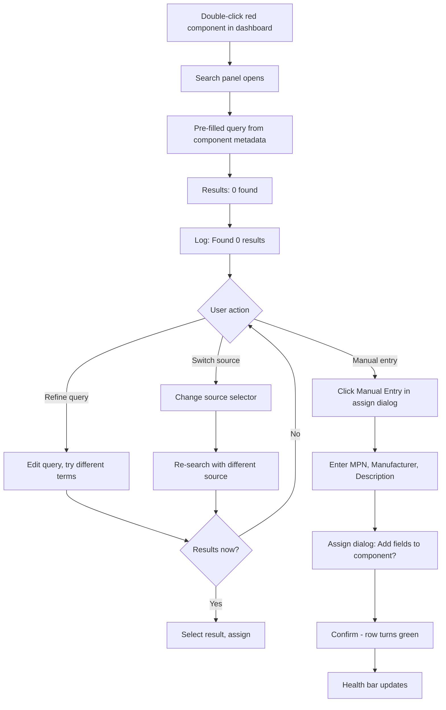
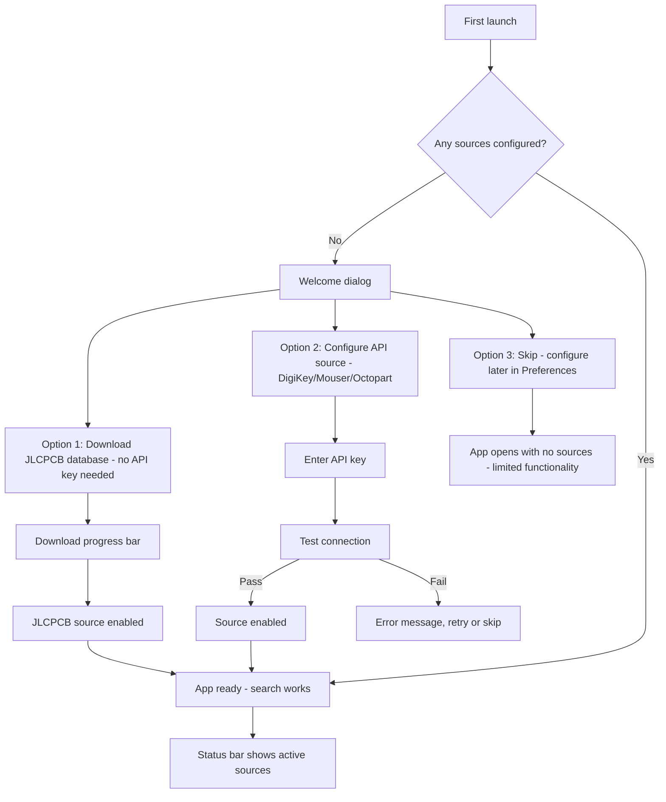
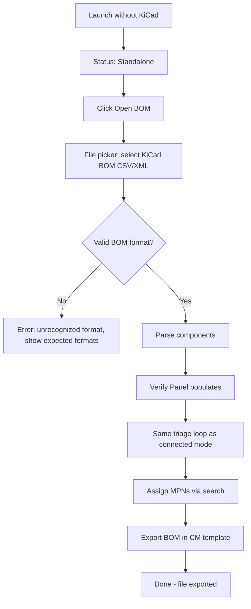
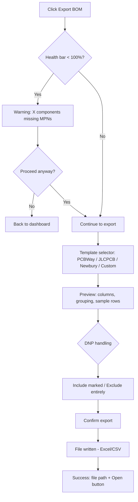

# UX Design Specification — KiPart Search

**Author:** Sylvain
**Date:** 2026-03-17

---

<!-- UX design content will be appended sequentially through collaborative workflow steps -->

## Executive Summary

### Project Vision

KiPart Search bridges the gap between KiCad component fields and distributor databases in a single desktop workflow: scan a board, verify what's there, discover what's missing, assign verified MPNs and supplier part numbers, and export a production-ready BOM. The tool already has a working Tier 1 MVP (search, scan, verify, assign). The next milestone adds BOM export with **multi-format template support** — the output that makes the entire workflow valuable to contract manufacturers.

The tool operates in two modes: **standalone** (load a KiCad-exported BOM file, enrich with MPNs and supplier part numbers, export as CM-ready BOM) and **connected** (live KiCad link via IPC API — scan the board, enrich, and push verified data back to KiCad symbol fields so the design files carry manufacturing references). The core workflow — verify, search, assign — is identical in both modes; only the input source and write-back target differ.

### Target Users

**Primary — Small-business hardware designer (Sylvain archetype):**
Professional PCB designer producing ~2 boards/month, ~70 components each. Subcontracts assembly to CMs who each require different BOM formats (PCBWay, JLCPCB, Newbury Electronics, custom). Needs 100% MPN coverage and format-correct BOM output on first submission. Desktop: Windows, KiCad 9+.

**Secondary — Hobbyist/Maker:**
2-5 boards/year, less experienced with component selection, typically uses JLCPCB assembly. Wants zero-config, immediate results from the offline database. May not need multi-format export — JLCPCB format is likely sufficient.

**Tertiary — Contract Manufacturer:**
Receives BOMs from clients. Benefits indirectly from cleaner, correctly-formatted submissions. Different CMs expect different column layouts, groupings, and naming conventions.

### Key Design Challenges

1. **Multi-format BOM export:** 5 different CM BOM templates collected (PCBWay, JLCPCB SMT, Newbury Electronics, generic supplier V1/V2), each with different column names, ordering, and grouping. UX must let users select a preset template or create custom ones.

2. **Supplier part number management:** Components need not just an MPN but also supplier-specific order codes (DigiKey P/N, LCSC #, Mouser #). Users must be able to add/view multiple supplier part numbers per component, and BOM templates must control which supplier columns appear in the export.

3. **Brownfield UI evolution:** The existing verify panel needs to surface supplier part numbers without becoming overloaded. The detail view or an expandable row could show per-supplier data.

4. **Template management complexity:** Templates define both column layout and which supplier part numbers to include. Preset + custom template support without becoming a spreadsheet editor.

5. **Progressive disclosure:** Hobbyists need one-click simplicity (JLCPCB database already provides LCSC numbers). Professionals need multi-supplier columns and custom templates.

6. **Dual-mode input/output:** Standalone mode needs a file import flow (Open BOM → enrich → export). Connected mode adds "Push to KiCad" to write MPNs, supplier P/Ns, and datasheets back to symbol fields. The UI must make the current mode obvious and the available actions clear without duplicating the entire interface.

### Design Opportunities

1. **Export as the "finish line":** The BOM export button is the natural endpoint of the scan→verify→assign workflow. It can serve as both the output action and a final validation gate (refuse/warn if MPN coverage < 100%).

2. **Template preview before export:** Showing users exactly what the exported BOM will look like (columns, grouping, naming) before writing the file builds confidence and catches format issues early.

3. **Auto-populated supplier P/Ns:** When a part is found via JLCPCB database, the LCSC number is already known. When DigiKey/Mouser adapters are added (Phase 2), their order codes come free with search results. The tool can progressively fill supplier columns as more sources are configured.

4. **Template ecosystem:** Preset CM templates (PCBWay, JLCPCB, Newbury Electronics) plus a custom template builder creates a competitive advantage — no other open-source KiCad tool offers multi-CM BOM export.

5. **KiCad as source of truth:** In connected mode, pushing enriched data back to symbol fields means the KiCad project carries all manufacturing references. Future BOM exports from KiCad itself will already be complete — the tool progressively makes itself less necessary for repeat builds of the same board.

## Core User Experience

### Defining Experience

The core loop of KiPart Search is **scan → triage → fix → export**:

1. **Scan** — Load components (from KiCad IPC API or from a KiCad BOM file)
2. **Triage** — See the verification dashboard: green (verified), amber (uncertain), red (missing/wrong)
3. **Fix** — Double-click a problem component → guided search → assign MPN + supplier P/Ns. Health bar updates live after each assignment — no manual re-scan needed
4. **Export** — Generate a CM-ready BOM in the selected template format, and/or push enriched fields back to KiCad

This loop repeats until the health bar reaches 100% and the BOM exports cleanly. Every UX decision should minimize friction within this loop.

### Platform Strategy

- **Desktop application**: PySide6 (Qt6), standalone process, Windows primary, Linux/macOS secondary
- **Input**: mouse + keyboard — no touch optimization needed
- **Offline-first**: Full functionality after initial JLCPCB database download. Online sources (DigiKey, Mouser) enrich but are not required
- **Connected mode is primary**: Auto-detect KiCad IPC API connection. Prominent "Connect to KiCad" action. Standalone BOM import is a secondary path, visually subordinate — not equal-weight. Both modes share the same dashboard, search, and assignment flows
- **KiCad connection indicator**: A persistent visual indicator (status bar badge or icon) shows connection state — "Connected to KiCad" (active color) vs "Standalone" (neutral). State changes are visible immediately without user action

### Effortless Interactions

- **Red → assigned in 3 clicks**: Double-click problem component → review pre-filled search results → double-click a part to assign. The guided search, query transformation, and unit equivalence should make the first result set immediately relevant
- **Live dashboard updates**: Health bar and per-component status update immediately after each assignment — no full re-scan required. The user sees progress in real time
- **Auto-populated supplier P/Ns**: When assigning a part from JLCPCB database, the LCSC number is already known. DigiKey/Mouser order codes come free with their search results. No manual entry of supplier codes when the tool already has them
- **BOM export with per-export template selection**: Pick a preset (PCBWay, JLCPCB, Newbury, etc.) or a custom template → preview → export. Template selection is per-export, not a global setting — the same board can be exported in multiple formats without re-doing any work
- **Mode detection is automatic**: If KiCad is running with IPC API, the tool connects and shows it. If not, standalone mode is active. No manual mode switching

### Critical Success Moments

1. **First scan "aha"**: User clicks "Scan Project" (or loads a BOM file) and immediately sees the health dashboard — "your BOM has these 23 problems, here's how to fix each one." This is the moment the tool proves its value.

2. **Guided search hit**: Double-click a missing-MPN component → search returns relevant results immediately, pre-filtered by value and package. The user thinks: "it already knows what I'm looking for."

3. **Clean export**: Health bar at 100%, click Export, select a CM template, file is generated. CM accepts it without corrections. This is the payoff for the entire workflow.

4. **Safe write-back to KiCad**: Plain-language confirmation: "Add MPN: GRM21BR71C104KA01L to C12? [Yes] [No]". Fields are **added** to the symbol — never overwriting the symbol description or existing data. Power users can expand a detail view to see all field changes, but the default is simple and clear.

### Safety & Reversibility

Write-back to KiCad is the highest-risk interaction. The following safety principles are non-negotiable:

- **Add, never overwrite**: Write-back adds fields (MPN, manufacturer, supplier P/Ns, datasheet) to the symbol. It must **never** overwrite the symbol description or any existing non-empty field without explicit per-field confirmation
- **Plain-language confirmation**: Default assign dialog is simple: "Add [field]: [value] to [reference]? [Yes] [No]". Expandable detail view for power users showing all field changes
- **Silent timestamped backups**: Before any write-back session, the tool automatically creates a backup of the affected design files in a dedicated location (`~/.kipart-search/backups/[project]/[YYYY-MM-DD_HHMM]/`). Backups are silent — no user action required
- **Backup browser**: A menu item or settings panel lets users view all available backups and restore from any previous backup. Restore is surfaced prominently only when the tool detects something unexpected (e.g., field changes that don't match the log)
- **Cancel/revert**: User can cancel mid-session (no partial writes) and revert to any backup at any time
- **Undo log**: Every write is logged (timestamp, reference, field, old value, new value) as a CSV file that survives beyond KiCad's undo stack

### BOM Export Considerations

- **MPN is the primary identifier**: Manufacturer part number is always the authoritative field. Supplier-specific codes (LCSC #, DigiKey P/N, Mouser #) are supplementary columns controlled by the selected template
- **Grouping by MPN + manufacturer**: Components with the same MPN from different manufacturers are separate rows. Same MPN, same manufacturer = grouped with combined designators and quantities
- **DNP handling**: User chooses per-export whether Do Not Place components appear in the BOM (clearly marked) or are excluded entirely
- **Stale detection**: Each component carries a "last verified" timestamp. When reopening a project after a database update, stale components are flagged for re-verification

### Experience Principles

1. **Dashboard-first**: The verification dashboard is the home screen. Everything starts and ends here — it shows progress, surfaces problems, and confirms success
2. **Guided, not gated**: The tool guides users toward complete BOMs but never blocks them. Missing data is warned, not forbidden. Partial exports are possible with clear warnings
3. **Safety by default**: No silent writes, no overwriting, automatic backups, undo log. The user must never fear that the tool will damage their design
4. **Same tool, any input**: Connected and standalone modes share the same UI and workflow. Connected mode is primary, standalone is the fallback. The connection indicator is the only visible difference
5. **Progressive enrichment**: Start with JLCPCB database (zero-config). Add API keys for richer data. Each source adds supplier P/Ns automatically. The tool gets better with use
6. **Freshness awareness**: Components carry verification timestamps. The tool surfaces what's stale so users know what to re-check

## Desired Emotional Response

### Primary Emotional Goals

- **Confident and in control**: The user always knows what the tool is doing, what state their BOM is in, and that their design files are safe. Every action is visible, reversible, and confirmed.
- **Efficient and productive**: The manual 3-hour BOM grind is replaced by a guided 20-minute workflow. The tool eliminates the tedious parts (searching distributor websites, copy-pasting MPNs) and lets the engineer focus on engineering decisions.
- **Relief and accomplishment**: When the health bar hits 100% and the BOM exports cleanly, the user feels: "this is done, and done right." The anxiety of "did I miss something?" is replaced by verified confidence.

### Emotional Journey Mapping

| Stage | Current Feeling (without tool) | Desired Feeling (with tool) |
|-------|-------------------------------|----------------------------|
| **Starting BOM work** | Dread — "I have 70 components to look up manually" | Clarity — "I can see exactly what needs attention" |
| **First scan** | N/A | Surprise + motivation — "it already found 23 issues and knows what I need" |
| **Searching for parts** | Scattered — multiple browser tabs, context-switching | Focused — one search panel, pre-filled queries, relevant results |
| **Assigning MPNs** | Anxious — "am I putting the right value in the right field?" | Protected — plain-language confirmation, no silent overwrites |
| **Something goes wrong** | Panic — "did I corrupt my design file?" | Informed — "the tool caught this, here's what happened, backup available" |
| **Exporting BOM** | Uncertain — "will the CM accept this?" | Accomplished — "100% verified, correct format, done" |
| **CM response** | Dreading the "fix these issues" email | Nothing — no email, BOM was accepted silently |
| **Returning to tool** | N/A | Familiar — same tool, same workflow, any project |

### Micro-Emotions

**Critical to get right:**
- **Confidence > Confusion**: Every status indicator, every color code, every action label must be unambiguous. The user never wonders "what does amber mean?"
- **Trust > Skepticism**: The tool earns trust through transparency — showing sources, verification timestamps, backup confirmations. Silent magic breeds suspicion in engineering tools; visible correctness builds trust
- **Accomplishment > Frustration**: Each green component is a visible win. The health bar filling up provides momentum. The workflow is designed so the user always makes forward progress

**Important but secondary:**
- **Calm > Anxiety**: Write-back safety (backups, undo log, no overwrites) eliminates the fear of irreversible mistakes
- **Satisfaction > Tedium**: The guided search and auto-populated fields replace the most tedious parts of BOM work

### Design Implications

| Emotional Goal | UX Design Approach |
|---------------|-------------------|
| **Confident** | Health bar with percentage, color-coded rows, explicit status labels ("Verified", "Missing MPN", "Not Found"), plain-language dialogs |
| **In control** | User initiates every action (scan, assign, export). No auto-writes. Cancel available at every step. Per-export template selection |
| **Efficient** | Guided search pre-fills queries, auto-populated supplier P/Ns, live dashboard updates, 3-click assignment |
| **Protected** | Silent backups, undo log, "add never overwrite" policy, backup browser for restore. Errors caught early with clear messages |
| **Informed** | Source provenance on every data point, verification timestamps, log panel with activity history, export preview before writing |
| **Accomplished** | Health bar celebrates 100%, export confirmation, no CM bounce-back |

### Emotional Design Principles

1. **Transparency over magic**: Always show where data comes from, what the tool is doing, and what will change. Engineers trust tools they can verify, not tools that "just work" opaquely
2. **Progress is visible**: Every assignment moves the health bar. Every green row is a confirmed win. The user always sees forward momentum
3. **Errors are guidance, not punishment**: A red component isn't a failure — it's a clear next step. "Not found in database" is accompanied by "search manually" or "enter MPN directly"
4. **Safety is silent until needed**: Backups happen automatically. The undo log writes quietly. These safety nets are invisible during normal use and surface only when the user needs them
5. **The tool gets out of the way**: Minimal chrome, maximum data. The focus is always on the components, the search results, the verification status — not on the tool's interface

## UX Pattern Analysis & Inspiration

### Inspiring Products Analysis

**kicad-jlcpcb-tools (KiCad plugin)**
- **What it does well**: Fast part lookup, tight KiCad integration, simple UI inside the editor. Users can find and assign JLCPCB parts without leaving KiCad.
- **Where it falls short**: Limited to LCSC/JLCPCB database — many components can't be found. No multi-source search. No BOM verification or export workflow.
- **UX lesson**: Speed and integration matter more than feature richness. KiPart Search must match this speed with the JLCPCB offline database and extend it with API sources.

**Distributor websites (DigiKey, Mouser, LCSC)**
- **What they do well**: Deep parametric filtering, comprehensive data, pricing and stock. DigiKey's category-based parametric search is the gold standard for narrowing down components.
- **Where they fall short**: Not integrated with KiCad. Context-switching between browser tabs and the design tool. Copy-paste workflow. Each distributor is a separate silo.
- **UX lesson**: Parametric filtering is powerful but must be brought into the tool. Results flow directly into the BOM — no copy-paste.

**Excel BOM files (status quo)**
- **What they do well**: Universal format, every CM accepts them, simple to understand.
- **Where they fall short**: Static — no validation, no interactivity, no connection to the design. Errors discovered downstream by the CM.
- **UX lesson**: The BOM should be a live, interactive dashboard — not a dead file. Export to Excel is the output, not the workspace.

### Transferable UX Patterns

**Search Architecture — Two Modes:**

The search interface supports two modes with the same UI — the difference is under the hood.

**Mode 1: Specific Search**
```
[Source selector: JLCPCB ▼] [Search box: "100nF 0805"] [Search]
         ↓
   Query → single API/database
         ↓
   Results table (single source)
         ↓
   Filters populate from returned data (manufacturer, package, etc.)
         ↓
   User applies filters → local filtering or re-query to same source
```

**Mode 2: Unified Search**
```
[Source selector: All Sources ▼] [Search box: "100nF 0805"] [Search]
         ↓
   Query cascades → JLCPCB + DigiKey + Mouser + Octopart (parallel)
         ↓
   Results table with "Source" column (merged, deduplicated by MPN)
         ↓
   Filters populate from union of all returned parameters
         ↓
   User applies filters → filters cascade back to each API → re-query → updated results
```

**UI Implementation:**
- Source selector is a dropdown or toggle group at the top of the search panel: "JLCPCB" / "DigiKey" / "Mouser" / "Octopart" / "All Sources"
- The search box and filter panel are identical in both modes — the user doesn't learn two interfaces
- "All Sources" is the default for discovery. Specific source is useful when the user knows where to look (e.g., "I need a JLCPCB part for assembly")

**Filter Behavior:**
- Filters are dynamic — they populate from the data that comes back, not from a static list
- Each source may enable different filters: JLCPCB returns category/package, DigiKey adds voltage/tolerance/temperature
- In Unified mode, a filter that only one API supports is still shown — it narrows results from that source while other sources show unfiltered results
- Filter chips or tags show which filters are active: "Package: 0805 x" / "Manufacturer: Murata x"

**Navigation & Information Hierarchy:**
- Dashboard-first (from CI/CD tools): Status overview with drill-down. Health bar → component list → detail view
- Collapsible side panel (from IDEs like VSCode): Search panel slides in when needed, collapses when not

**Interaction Patterns:**
- Click-to-highlight cross-probe: Click a component → highlights in KiCad. The bridge between abstract BOM data and physical board layout
- Pre-filled search from context: Double-click a missing-MPN component → search pre-fills with value + package
- Multi-source aggregation with provenance: Each result row shows its source. Multiple sources for the same MPN are merged with all supplier P/Ns collected

### Anti-Patterns to Avoid

1. **Excel-as-workspace**: Never make the user feel like they're filling in a spreadsheet. The BOM is a live dashboard with verification, search, and assignment
2. **Modal overload**: Don't stack dialogs. Assign confirmation should be lightweight. Avoid nested modals
3. **Hidden state**: Never leave the user wondering what mode they're in, what's been saved, or whether KiCad is connected. State must always be visible
4. **Feature-gated onboarding**: Don't require API key setup before the tool is useful. JLCPCB offline database provides immediate value with zero configuration
5. **Over-automated writes**: Never write to KiCad files without explicit user action
6. **Forcing unified search complexity on simple tasks**: If a user just wants to look up a specific JLCPCB part, they shouldn't wait for 4 APIs. Specific source mode is the escape valve for speed and simplicity
7. **Pretending all APIs have the same capabilities**: Don't show a "Voltage" filter and silently ignore it for sources that don't support it. Be transparent about which filters apply to which sources

### Design Inspiration Strategy

**What to Adopt:**
- kicad-jlcpcb-tools' speed and tight integration feel
- Dashboard-first navigation (health bar → component list → detail → action)
- Click-to-highlight cross-probe as the primary bridge
- Pre-filled guided search as the core assignment workflow
- Two-mode search (Specific + Unified) with identical UI

**What to Adapt:**
- DigiKey's parametric filtering — dynamic filters that populate from returned data, not a static form
- Octopart's multi-source aggregation — source provenance per result, merged by MPN
- Filter cascade in Unified mode — re-query APIs with user-applied filters

**What to Avoid:**
- Excel-as-workspace pattern — the tool is interactive, not a spreadsheet
- Distributor website context-switching — everything in one window
- Modal-heavy confirmation flows — lightweight, plain-language dialogs
- Feature-gating behind API keys — zero-config first, enrichment later
- One-size-fits-all search — let users choose specific or unified mode

## Design System Foundation

### Design System Choice

**Qt Native + Future Custom QSS Theme** — The application uses Qt's built-in widget styling with platform-native look and feel. A custom QSS theme is planned for later to formalize the visual language but is not a current priority.

### Rationale for Selection

- Solo developer — no time budget for design system work when the core workflow (BOM export, multi-source search) is the priority
- Existing UI already works and looks acceptable with Qt native styling
- Engineering tool users prioritize function over form — native look is familiar and trusted
- The color-coding system (GREEN/AMBER/RED) is already implemented and is the most important visual element

### Implementation Approach

**Current (no change):**
- Qt native widget styling on all platforms
- Color constants defined in code: GREEN=#C8FFC8, AMBER=#FFEBB4, RED=#FFC8C8
- Status bar badge with colored pill for connection/mode indicator
- Monospace font in log panel

**Future (when prioritized):**
- Custom QSS stylesheet defining design tokens: color palette, spacing units, font sizes, border radii
- Consistent component styling across all panels (verify, search, detail, dialogs)
- Optional dark mode support
- No new dependencies — pure QSS

### Customization Strategy

The visual identity is defined by **function, not brand**:
- Color means status: green = verified, amber = uncertain, red = problem
- Layout means workflow: left panel = triage, right panel = search/fix
- Typography means hierarchy: monospace for data, proportional for labels

These conventions are already established in the codebase. The future QSS theme will formalize them, not reinvent them.

## Defining Experience

### The Core Interaction

**"Scan your board, see what's wrong, fix it in clicks, export a clean BOM."**

The defining experience is the **triage-to-resolution momentum**: every problem component has an obvious next action, every action produces visible progress, and the health bar fills until the BOM is ready. The user never feels stuck.

### User Mental Model

**How users currently solve this problem:**
1. Open KiCad, note which components need MPNs
2. Open browser tabs for DigiKey, Mouser, LCSC
3. Search each distributor separately, compare results
4. Copy-paste MPNs into KiCad symbol fields one by one
5. Manually build a BOM spreadsheet in Excel
6. Send to CM, wait for "fix these issues" email, repeat

**Mental model they bring to KiPart Search:**
- "I have a board with components. Some are complete, some aren't. Show me what's missing and help me fix it."
- Source selection is a preference, not a constraint — users choose their suppliers the way they choose their distributors. Some users are DigiKey-only, some are Mouser-only, some mix sources.
- The JLCPCB offline database is the easiest starting point (no API key), but it's not mandatory. A user who only orders from Mouser should never feel like a second-class citizen.

### Success Criteria

1. **"This just works"**: User scans, sees the dashboard, immediately understands what to do next
2. **"It found what I'm looking for"**: Guided search returns relevant results from the user's enabled sources on the first query
3. **"I trust the results"**: Source provenance is visible. Mismatch warnings catch errors before assignment
4. **"I'm making progress"**: Every assignment turns a row green and moves the health bar
5. **"The BOM is done"**: 100% health bar, export in the right template, CM accepts it

### Novel UX Patterns

The individual patterns are all established (dashboards, search, filtering, cross-probe, template export). What's novel is the integration:

- Two search modes (Specific + Unified) with dynamic filter cascading
- Guided search from BOM context — pre-filled from component metadata, using user's enabled sources
- Live write-back to KiCad with safety guarantees
- Multi-CM BOM export with per-export template selection
- Source configuration as a preference — not hardcoded, not JLCPCB-centric

No new interaction metaphors needed — the innovation is connecting established patterns into a single uninterrupted workflow.

### Experience Mechanics

**0. Configuration — Source Preferences**

| User Action | System Response | Feedback |
|------------|----------------|----------|
| Open Preferences / Settings | Source configuration panel shows all available sources | Each source: name, status (enabled/disabled), API key status |
| Enable a source | Source appears in search bar selector | If API key required: key entry field shown with "Test" button |
| Enter API key + click "Test" | Validate credentials against the API | Green checkmark = valid, red X = invalid with error message |
| Disable a source | Source hidden from search bar selector | No queries sent to disabled sources |
| Set default source | Preferred source pre-selected in search bar | Guided search also uses this default |

**Preference-driven behavior:**
- Search bar source selector only shows enabled sources
- Guided search uses the user's default source, or "All Sources" if multiple are enabled and no default is set
- JLCPCB offline database is the easiest to enable (no API key), but is not special — it's just another source in the list
- First-run experience: if no sources are configured, the tool prompts to download the JLCPCB database or configure an API key

**1. Initiation — Scan**

| Trigger | Action | Result |
|---------|--------|--------|
| Connected mode: Click "Scan Project" | Read components via KiCad IPC API | Dashboard populates with all components |
| Standalone mode: Click "Open BOM" | Import KiCad BOM file (CSV/XML) | Dashboard populates from file |
| Return visit: Open tool with cached data | Load previous scan from cache | Dashboard shows last-known state with stale indicators |

**2. Interaction — Triage & Fix**

| User Action | System Response | Feedback |
|------------|----------------|----------|
| View dashboard | Components sorted by status (red first) | Health bar shows % complete, summary counts |
| Click a component row | Detail panel shows all fields + status | In connected mode: KiCad highlights the component |
| Double-click a red/amber component | Search panel opens, query pre-filled from component metadata | Source selector respects user's enabled sources and default |
| Select source mode (Specific/Unified) | Search queries go to selected source(s) | Results table shows "Source" column in Unified mode |
| Apply filters (manufacturer, package, etc.) | Specific: local filter. Unified: cascade back to APIs | Result count updates, filter chips show active filters |
| Double-click a search result | Assign dialog opens with plain-language confirmation | Shows "Add [field]: [value] to [reference]?" |
| Confirm assignment | Fields written (to KiCad in connected mode, to local state in standalone) | Row turns green, health bar updates live |

**3. Feedback — Continuous Progress**

- Health bar fills with each assignment — visible momentum
- Row color changes immediately (red → green)
- Log panel records each action with timestamp
- Summary counts update: "Missing MPN: 38 → 37"
- In connected mode: KiCad highlights the just-assigned component as visual confirmation

**4. Completion — Export**

| User Action | System Response | Feedback |
|------------|----------------|----------|
| Click "Export BOM" | If health < 100%: warning dialog with option to proceed or go back | Clear message: "12 components still missing MPNs" |
| Select template (PCBWay, JLCPCB, custom, etc.) | Preview shows exact columns, grouping, and data | User sees the file before it's written |
| Confirm export | File written (Excel/CSV) | Success message with file path, option to open |
| In connected mode: Click "Push to KiCad" | Write enriched fields back to symbol fields | Backup created silently, confirmation per component or batch |

## Visual Design Foundation

### Color System

**Status Colors (functional — already implemented):**
- **Green** (#C8FFC8): Verified, valid, complete
- **Amber** (#FFEBB4): Uncertain, needs attention, unverified
- **Red** (#FFC8C8): Missing, not found, error

**UI Colors (Qt native defaults):**
- Background, text, borders: Qt platform-native (Windows/Linux/macOS defaults)
- Status bar badge: green pill = connected/active source, gray pill = no source
- No brand color palette — the tool's visual identity is defined by status colors, not branding

### Typography System

- **UI text**: Qt system default font (platform-native)
- **Data / log panel**: Monospace (Consolas 11px on Windows, system monospace elsewhere)
- **Hierarchy**: Qt default size distinctions — no custom type scale needed
- **No custom fonts** — keeps the tool lightweight and platform-native

### Spacing & Layout Foundation

- **Density**: Dense and efficient — engineering tool style. 4px margins, 4px spacing
- **Layout**: QSplitter-based panels. Left = triage dashboard (60%), Right = search panel (40%, collapsible)
- **Minimum window**: 1000x600px
- **Panels**: Vertically split within each side (table top 75%, detail bottom 25%, collapsible)
- **Log panel**: Fixed max height 90px at bottom of window

### Accessibility Considerations

- Status colors are supplemented with text labels ("Verified", "Missing MPN", "Not Found") — not color-only indicators
- All interactive elements are keyboard-accessible via Qt's built-in focus handling
- Monospace font for data ensures alignment and readability of technical content (MPNs, part numbers)
- No accessibility audit planned for MVP — revisit when community feedback arrives

### Credits

- **Author**: Sylvain Boyer (MecaFrog) — www.mecafrog.com | www.the-frog.fr
- **License**: MIT
- Help/About dialog includes: app name, version, author, websites, license

## Design Direction Decision

### Design Directions Explored

Three layout approaches were evaluated:

1. **Evolved Current Layout** (QSplitter, 2 panels) — minimal change, but limits flexibility
2. **3-Panel Fixed Layout** (QSplitter, 3 panels) — more space for detail, but rigid arrangement
3. **Hybrid Dockable Panels** (QDockWidget) — dock/undock/float/tab panels with sensible defaults

### Chosen Direction

**Direction 3: Hybrid Dockable Panels (QDockWidget)**

Each major panel is a QDockWidget that can be docked, undocked (floating window), tabbed, or hidden. Qt handles all drag-and-drop docking behavior natively. The application ships with a sensible default layout and allows full user customization.

**Default Layout (ships out of the box):**
```
[Toolbar: Scan/Open BOM | Export BOM | Push to KiCad | Preferences]
[Verify Panel (left)   |  Search Panel (center)  |  Detail Panel (right)]
[  component table      |  [Source: ▼] [Query]    |  selected part specs  ]
[  + summary/health bar |  [Filter chips]         |  pricing, datasheet   ]
[                       |  results table          |  assign action        ]
[Log Panel (bottom, dockable)]
[Status Bar: mode badge | source status | KiCad connection]
```

**User can customize:**
- Drag any panel to a different dock position (left, right, top, bottom)
- Undock/float any panel as a separate window (ideal for dual monitors — e.g., search panel on monitor 2)
- Tab panels together in the same dock area (e.g., detail + log as tabs)
- Hide panels via View menu (e.g., hide log panel when not needed)
- Resize docked panels by dragging dividers

**Layout persistence:**
- Qt saves/restores dock layout state between sessions automatically (QMainWindow::saveState/restoreState)
- "View → Reset Layout" menu option restores the default arrangement

### Design Rationale

- **Familiar to KiCad users**: KiCad itself uses dockable panels (layers manager, properties, selection filter). The mental model is already there.
- **Multi-monitor support**: Engineers often work with dual monitors. Floating the search panel on a second screen while keeping the verification dashboard on the primary is a significant productivity gain.
- **Progressive complexity**: Default layout works well for beginners. Power users discover docking/floating naturally through drag-and-drop.
- **Qt-native**: QDockWidget is a built-in Qt class — no custom widget code needed. The docking, floating, tabbing, and state persistence are all handled by the framework.
- **Future-proof**: Adding new panels (e.g., BOM preview panel, compare panel) is trivial — just add another QDockWidget.

### Implementation Approach

**Panels as QDockWidgets:**

| Panel | Default Position | Content | Can Float? |
|-------|-----------------|---------|-----------|
| **Verify Panel** | Left dock | Component table, health bar, summary | Yes |
| **Search Panel** | Center dock | Source selector, query bar, filter chips, results table | Yes |
| **Detail Panel** | Right dock | Selected part specs, pricing, datasheet link, assign button | Yes |
| **Log Panel** | Bottom dock | Timestamped activity log | Yes |

**Toolbar (fixed, not dockable):**
- Scan Project / Open BOM (dual-mode initiation)
- Export BOM (opens template selection)
- Push to KiCad (connected mode only — grayed out in standalone)
- Preferences (source configuration, settings)

**View menu:**
- Toggle visibility of each panel
- Reset Layout (restore defaults)

**Migration from current code:**
- Replace QSplitter with QDockWidget wrappers around existing panel widgets
- Existing panel code (VerifyPanel, SearchBar, ResultsTable, LogPanel) remains unchanged — only the container changes
- Add QMainWindow::saveState/restoreState for layout persistence

## User Journey Flows

### Journey 1: Happy Path — Full Scan to Export



**Key moments:**
- Entry splits by mode (connected vs standalone) but merges at dashboard
- The triage loop (J→L→M→N→P→S→U→W→J) is the core experience — minimal steps, live feedback
- Export is the finish line with an optional Push to KiCad step
- Manual entry (Q→R) is a first-class path, not a hidden fallback

### Journey 2: Component Not Found — Manual Entry Fallback



**Key moments:**
- Three recovery paths: refine query, switch source, manual entry
- Manual entry is always accessible — never a dead end
- Source switching is quick (dropdown in search panel)

### Journey 3: First-Run Experience — Source Configuration



**Key moments:**
- JLCPCB is presented as the easiest option (no key), but not forced
- API key validation with test button gives immediate feedback
- User can skip entirely and configure later — never blocked

### Journey 4: Standalone BOM Import



**Key moments:**
- Same dashboard, same search, same assignment — just a different input source
- No KiCad-specific features (no highlight, no Push to KiCad) — gracefully hidden
- Clear error if BOM format is unrecognized

### Journey 5: BOM Export with Template Selection



### Journey Patterns

**Reusable patterns across all journeys:**

| Pattern | Usage | Description |
|---------|-------|-------------|
| **Mode-aware entry** | Journeys 1, 4 | Entry point branches by connected/standalone, merges at dashboard |
| **Triage loop** | Journeys 1, 2, 4 | Dashboard → select problem → search → assign → dashboard updates |
| **Three-path recovery** | Journey 2 | Refine query / switch source / manual entry — never a dead end |
| **Progressive gate** | Journey 5 | Warning with option to proceed, never a hard block |
| **Plain-language confirmation** | All assignments | "Add [field]: [value] to [reference]?" — not technical diff |
| **Live feedback** | All assignments | Row color + health bar update immediately |

### Flow Optimization Principles

1. **No dead ends**: Every "not found" or "error" state has at least one recovery action visible
2. **Merge early**: Connected and standalone paths diverge at entry, merge at the dashboard — one flow to learn
3. **Warn, don't block**: Incomplete BOM → warning with proceed option. Missing source → configure later. Never force the user to stop
4. **Feedback is immediate**: Row color, health bar, log entry — all update within the same interaction, no "refresh" needed
5. **Source-agnostic flows**: The triage loop works identically regardless of which sources are enabled. Only the results change, not the workflow

## Component Strategy

### Qt Standard Components (no custom work)

| Widget | Usage | Notes |
|--------|-------|-------|
| QDockWidget | All panels (verify, search, detail, log) | Dock/undock/float/tab |
| QTableWidget | Verification table, results table | Sortable, color-coded rows |
| QProgressBar | Health bar | Custom colors for % ranges |
| QLineEdit | Search input, query preview | Read-only for preview |
| QComboBox | Source selector, dynamic filter dropdowns | Key interaction element |
| QToolBar | Main toolbar actions | Fixed, not dockable |
| QStatusBar | Mode badge, source status, KiCad connection | Persistent indicators |
| QTextEdit | Log panel, detail browser | Read-only, HTML rendering |
| QMenuBar | File, View, Help menus | Standard Qt menus |
| QPushButton | All action buttons | Toolbar and dialog buttons |

### Custom Components

**1. Source Preferences Dialog (QDialog)**

**Purpose:** Configure which data sources are available and set API credentials
**Content:**
- List of all available sources (JLCPCB, DigiKey, Mouser, Octopart, etc.)
- Per-source: enable/disable toggle, API key input field (if needed), "Test Connection" button
- Default source selector (which source is pre-selected in search bar)
- Database management for JLCPCB (download, update, path)
**States:**
- Source enabled + configured (green indicator)
- Source enabled + key missing (amber indicator)
- Source enabled + key invalid (red indicator after test)
- Source disabled (grayed out)
**Interaction:** Opens from Preferences toolbar button or menu. Modal dialog — changes apply on close.

**2. BOM Export Window (QDialog or QMainWindow)**

**Purpose:** Select template, configure options, preview output, export file
**Content:**
- Template selector: preset list (PCBWay, JLCPCB, Newbury, custom) + "New Template" button
- Template preview: shows columns, sample rows from current BOM data
- Options: DNP handling (include marked / exclude), file format (Excel / CSV)
- Export button + file path selector
**States:**
- Health < 100%: warning banner at top ("12 components missing MPNs")
- Template selected: preview updates live
- Exporting: progress indicator
- Success: file path + "Open File" button
**Interaction:** Opens from "Export BOM" toolbar button. Non-modal window — user can go back to dashboard to fix issues without closing.

**3. Dynamic Filter Row (composite widget)**

**Purpose:** Narrow search results using filters that adapt to the data returned by active APIs
**Content:**
- A horizontal row of QComboBox dropdowns
- Dropdowns are created/removed dynamically based on search results
- Each dropdown is populated with unique values from the returned data for that field
- Common filters: Manufacturer, Package, Category
- API-specific filters: Voltage, Tolerance, Temperature (when DigiKey/Octopart return structured data)
- Result count label: "X of Y results"
**States:**
- No search yet: filter row empty/hidden
- After search: dropdowns appear for each filterable field returned by the source(s)
- Filter active: dropdown shows selected value, results narrowed
- Filter cleared: dropdown reset to "All", results restored
**Interaction:**
- In Specific mode: filters apply locally to the returned results
- In Unified mode: filters cascade back to APIs as refined queries → results update
- Dropdowns appear/disappear as sources change — user never sees empty filters for unsupported fields

**4. Health Summary Bar (composite widget)**

**Purpose:** At-a-glance BOM readiness status
**Content:**
- QProgressBar (health percentage, color-coded: red < 50%, amber 50-99%, green 100%)
- Summary text: "Components: 68 total | Valid MPN: 45 | Needs attention: 12 | Missing MPN: 11"
- Compact — fits above the verification table
**States:**
- Empty (no scan): hidden or shows "Scan a project to see BOM status"
- In progress: bar fills as assignments happen
- Complete (100%): green bar, "Ready for export" message
**Interaction:** Read-only display. Updates live after each assignment.

**5. Welcome / First-Run Dialog (QDialog)**

**Purpose:** Guide new users to configure at least one data source on first launch
**Content:**
- Welcome message with brief tool description
- Three options presented as cards or buttons:
  1. "Download JLCPCB Database" — no API key needed, ~500MB, progress bar
  2. "Configure API Source" — opens Source Preferences Dialog for DigiKey/Mouser/Octopart
  3. "Skip for now" — opens app with no sources, limited functionality
**States:**
- First launch only (check config file for previous setup)
- Download in progress: progress bar, cancel button
- Download complete: auto-close, app ready
**Interaction:** Modal dialog. Only shown once — user can always configure sources later via Preferences.

### Component Implementation Strategy

**Build order aligned with user journeys:**

| Priority | Component | Needed For | Complexity |
|----------|-----------|-----------|------------|
| 1 | Health Summary Bar | Dashboard (all journeys) | Low — composite of standard widgets |
| 2 | Dynamic Filter Row | Search panel (Journey 1, 2) | Medium — dynamic widget creation |
| 3 | Source Preferences Dialog | Source configuration (Journey 3) | Medium — form with API validation |
| 4 | Welcome Dialog | First-run experience (Journey 3) | Low — simple options dialog |
| 5 | BOM Export Window | Export flow (Journey 5) | Medium — template preview + file export |

**Implementation notes:**
- All custom components use standard Qt widgets internally — no painting, no custom rendering
- Dynamic Filter Row is the most architecturally interesting — needs a signal/slot contract between search results and filter creation
- BOM Export Window needs a template engine (mapping KiCad data → CM column format) — this is core logic, not just UI

## UX Consistency Patterns

### Feedback Patterns

**Status Communication — always use color + text + icon:**

| Severity | Color | Text Pattern | Usage |
|----------|-------|-------------|-------|
| **Success** | Green (#C8FFC8) | "Verified", "Assigned", "Exported" | Component verified, MPN assigned, BOM exported |
| **Warning** | Amber (#FFEBB4) | "Needs attention", "Unverified", "X components missing" | Uncertain status, incomplete BOM, stale data |
| **Error** | Red (#FFC8C8) | "Missing MPN", "Not found", "Connection failed" | Missing data, search failure, API error |
| **Info** | Neutral (Qt default) | "Searching...", "Scanning...", "X results" | Progress, counts, neutral status |

**Log panel messages:**
- Always timestamped: `[HH:MM:SS] message`
- Action confirmations: `[14:32:15] Assigned MPN GRM21BR71C104KA01L to C12`
- Errors with context: `[14:32:20] Search failed: DigiKey API timeout (retry in Preferences)`
- Never silent failures — every action has a log entry

**Status bar — persistent state indicators:**
- Left: mode badge ("Connected to KiCad" green pill / "Standalone" gray pill)
- Center: active sources ("JLCPCB + DigiKey" or "No sources configured")
- Right: last action or idle state

### Action Hierarchy

**Primary actions (toolbar buttons — always visible):**
- Scan Project / Open BOM — initiates the workflow
- Export BOM — the finish line
- Push to KiCad — write-back (grayed out in standalone mode)
- Preferences — source configuration

**Secondary actions (context-dependent):**
- Search button — inside search panel
- Assign button — inside detail panel or assign dialog
- Filter dropdowns — inside search panel

**Tertiary actions (menus and right-click):**
- View menu: toggle panel visibility, reset layout
- File menu: open BOM, export, quit
- Help menu: about, credits
- Right-click context menu on table rows: "Search for this component", "Assign MPN", "Copy MPN"

**Button placement rule:**
- Destructive or irreversible actions (Push to KiCad, Export) always require confirmation dialog
- Non-destructive actions (Search, Filter, Scan) execute immediately
- Cancel is always available and always safe

### State Patterns

**Every panel handles these states consistently:**

| State | Visual | Behavior |
|-------|--------|----------|
| **Empty** | Centered text with guidance | Verify panel: "Scan a project or open a BOM to begin" / Search panel: "Search for components using the query bar above" |
| **Loading** | Spinner or progress bar + "Scanning..." / "Searching..." | Toolbar buttons disabled during operation. Cancel available. |
| **Populated** | Normal data display | All interactions available |
| **Error** | Red text with action hint | "Connection failed — check Preferences" / "Database not found — click Download" |
| **Stale** | Amber indicator on affected rows | "Last verified: 2026-03-10 — database updated since. Re-scan recommended." |

**Empty states are not blank** — they always tell the user what to do next.

### Dialog Patterns

**Modal dialogs (block main window):**
- Source Preferences — configuration must complete before searching
- Assign confirmation — user must decide before proceeding
- Welcome / First-run — source setup before first use
- Dangerous confirmations — "Push to KiCad will modify design files"

**Non-modal windows (work alongside main window):**
- BOM Export — user may go back to dashboard to fix issues
- Database download — progress runs while user reads the UI

**Dialog structure rule:**
- Title: clear action name ("Assign MPN to C12" / "Export BOM")
- Content: plain language, minimal text
- Actions: right-aligned, primary button on the right, cancel on the left
- No nested dialogs — if a dialog needs sub-configuration, it navigates inline (e.g., source preferences shows API key field inline, not in a sub-dialog)

### Search & Filter Patterns

**Two-mode search (consistent UI, different backend):**

| Behavior | Specific Mode | Unified Mode |
|----------|--------------|-------------|
| Source selector | Single source selected | "All Sources" selected |
| Query execution | One API/database | Parallel to all enabled sources |
| Results table | No "Source" column | "Source" column visible |
| Filter dropdowns | Populated from single source's data | Populated from union of all sources' data |
| Filter application | Local filter on returned results | Cascade back to APIs, re-query |
| Speed | Fast (single source) | Slower (multiple sources, parallel) |

**Filter behavior rules:**
- Filters appear only after a search returns results — never pre-populated
- Each filter dropdown starts with "All" (no filter applied)
- Filters are additive — applying "Package: 0805" AND "Manufacturer: Murata" narrows to both
- Clearing a filter restores results (no need to re-search)
- Result count label always visible: "23 of 147 results" (filtered of total)

**Search input behavior:**
- Enter or Search button submits
- Live query preview (transformed query) shows below input
- Special character buttons (ohm, plus-minus, mu) insert at cursor
- Query persists until cleared — switching sources re-runs the same query

### Table Interaction Patterns

**Consistent across verification table and results table:**

| Action | Behavior |
|--------|----------|
| Single click row | Select row, show detail in detail panel. In connected mode: highlight in KiCad |
| Double-click row | Context action: verify table → guided search / results table → assign dialog |
| Right-click row | Context menu with available actions |
| Column header click | Sort by column (toggle asc/desc) |
| Row background color | Status-coded (green/amber/red) in verify table. Neutral in results table |

**Selection is always single-row** — no multi-select needed for current journeys. Can be added later for batch operations.

## Responsive Design & Accessibility

### Window Resizing Strategy

- **QDockWidget handles layout adaptation** — panels resize, dock, undock, and tab automatically via Qt's built-in behavior
- **Minimum window size**: 1000x600px — below this, panels become too narrow for table data
- **Small screens**: User can hide panels (View menu) to give more space to the active panel. Log panel can be collapsed entirely
- **Large screens / multi-monitor**: Undock panels to separate windows. Verification on monitor 1, search on monitor 2
- **Layout persistence**: Qt saves/restores panel arrangement between sessions

### Cross-Platform Considerations

- **Windows (primary)**: Qt native look. Consolas for monospace. Standard Windows file dialogs
- **Linux**: Qt follows the active desktop theme (KDE/GNOME). System monospace font. Native file dialogs
- **macOS**: Qt approximates native look. System monospace font. Standard macOS file dialogs
- **No platform-specific code paths in GUI** — Qt handles differences. Use `pathlib.Path` everywhere for file paths

### Accessibility Strategy

**Level: Basic (Qt defaults + targeted improvements)**

No formal WCAG compliance target for MVP. Rely on Qt's built-in accessibility support with targeted additions:

- **Color is never the only indicator**: Status rows use color + text label ("Verified", "Missing MPN", "Not Found"). A color-blind user can read the status without seeing the color
- **Keyboard navigation**: Qt provides built-in Tab/Shift-Tab focus traversal, Enter to activate, Escape to cancel. No custom keyboard handling needed for MVP
- **Screen reader**: Qt widgets expose accessibility roles by default. Custom widgets (Health Summary Bar, Dynamic Filter Row) should set `setAccessibleName()` and `setAccessibleDescription()`
- **Font sizing**: Qt respects system-level font scaling (Windows display scaling, Linux DPI settings). No hardcoded pixel sizes for text except log panel monospace (Consolas 11px — acceptable)
- **Contrast**: Status colors (#C8FFC8, #FFEBB4, #FFC8C8) are pastel backgrounds with dark text — adequate contrast for normal vision. Not optimized for low-vision users in MVP

### Testing Strategy

- **Manual testing on Windows** (primary development platform)
- **Occasional testing on Linux** (Ubuntu with KDE — closest to KiCad power users)
- **macOS testing deferred** until community demand
- **No automated accessibility testing** for MVP — revisit when community feedback surfaces specific issues
- **Keyboard-only navigation walkthrough**: verify that the full scan→search→assign→export flow can be completed without mouse (nice-to-have, not blocking)
